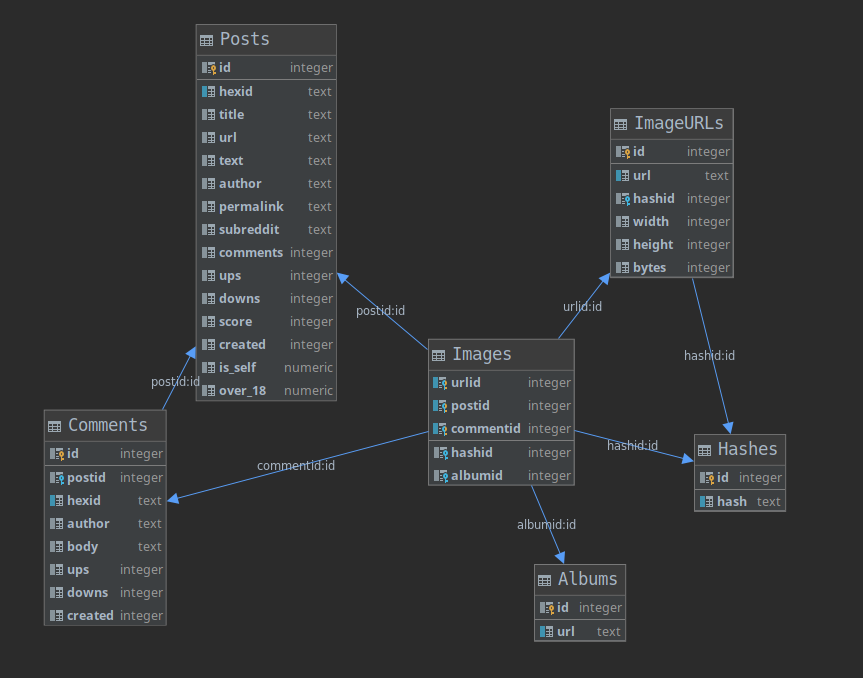

irarchives
==========

Summary
-------
Reverse image/video search for reddit

Realtime dhash demo. The hash (on the right) is stored as a 144-bit 
integer. We can compute the similarity of two images by counting the number
 of matching bits of their hashes.

Overview
--------

The repo contains:
* A script to scrape images from reddit posts and store the data in a database.
* A web interface for searching the database

### Database schema

Requirements
------------
Tested with Python 3.7.2.

Dependencies on Debian: `apt install libgmp-dev libmpfr-dev libmpc-dev`

This project relies on [Architeuthis MITM proxy](https://github.com/simon987/Architeuthis) to respect rate-limits
and handle http errors. 

[Additional C-Language functions](https://github.com/simon987/pg_hamming) 
for PostgreSQL need to be installed for almost all queries.

The search interface can be configured to use *redis* for caching 
(see [common.py](common.py)).
